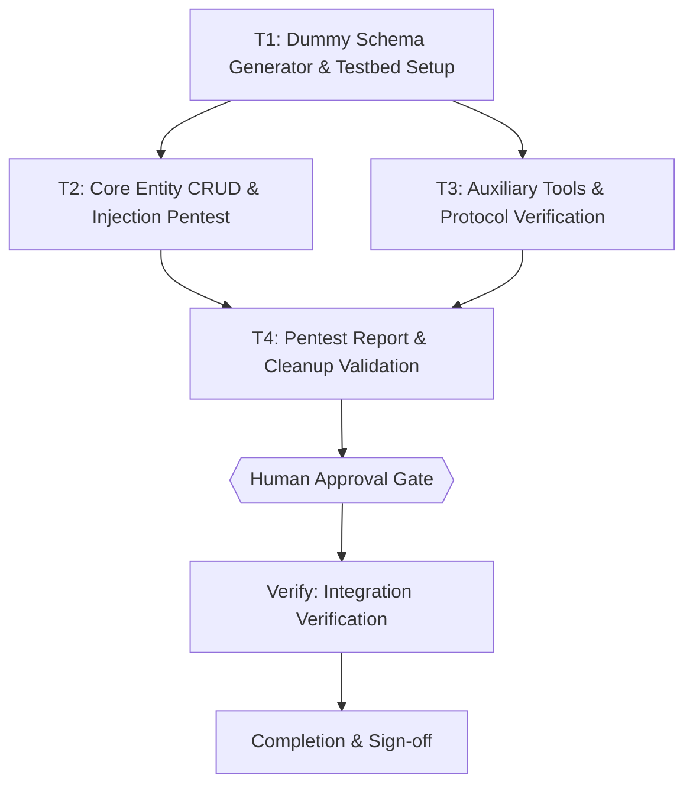

# Penetration Testing & Tool Verification Plan for snipset-cli

> The YAML frontmatter above is the single source of truth for routing, dependency order, retry, and idempotency. Prose and checklists below only explain and must never contradict it. Every `Task N` heading, its `tasks[].id`, and its Mermaid node id must be the same identifier; a mismatch is a pre-execution blocker. Commands stay tool-agnostic and directly runnable.

## 1. Intent & Scope
- **Goal:** Melakukan penetration testing, robustness verification, dan functional audit untuk seluruh tools dan subcommands `snipset-cli` tanpa memodifikasi atau merusak live database desktop, menggunakan skema dummy SQLite terisolasi yang cocok 100% dengan fingerprint schema aplikasi, dan mendokumentasikan hasilnya dalam format daftar laporan terstruktur.
- **Non-Goals:** Mengubah kode biner native `snipset` (aplikasi precompiled Rust); mengeksekusi migrasi atau penghapusan pada live database Snipset Desktop; mengubah arsitektur sistem inti Snipset; melakukan testing destruktif pada sistem host di luar folder temporer `/tmp`.
- **Acceptance Criteria:**
  - [x] AC-1: Skema SQLite dummy aman terbuat di direktori temporer dengan seluruh tabel, kolom runtime (`snippets`, `groups`, `snippets_fts`, `preferences`, `clipboard_history`, `speech_history`, `tts_history`, `speech_dictionary`, `journals`, `todo_tasks`, `todo_projects`, `todo_smart_folders`, `notes`, `usage_events`, `analytics_events`), FTS5 triggers, dan WAL mode, diverifikasi dengan exit code 0 oleh `snipset doctor --db <path>`.
  - [x] AC-2: Seluruh 15 subcommands CLI (`doctor`, `snippet`, `group`, `clipboard`, `audio`, `journal`, `task`, `note`, `pomodoro`, `stats`, `reference`, `support`, `settings`, `import`, `export`, `mcp`) dan wrapper `scripts/snipset-live.sh` diuji secara sistematis terhadap input valid, edge cases (karakter aneh, unicode, UUID tidak valid, injeksi kutip SQL), dan graceful degradation saat live desktop app bridge offline.
  - [x] AC-3: Laporan hasil pengujian dihasilkan dalam format daftar markdown lengkap di `docs/verification/2026-09-21-snipset-cli-pentest-report.md` yang merinci setiap tool/perintah, status (PASS / FAIL / DEGRADED-BY-DESIGN), bukti output, dan catatan keamanan.
  - [x] AC-4: Seluruh test suite (`bun test tests/*.test.mjs`) lulus (exit 0, 0 failures), file database temporer dibersihkan, dan repo siap untuk commit conventional atas nama Iwan Kurniawan.

## 2. Visual Implementation Map — MANDATORY (approval gate blocker if missing)

## 3. Global Constraints
- Database live Snipset Desktop (`$LOCALAPPDATA/Snipset/snipset.db` atau `~/.local/share/Snipset/snipset.db`) DILARANG diutak-atik atau disentuh secara destruktif. Seluruh uji tulis dan mutasi wajib menargetkan dummy DB terisolasi di `/tmp/snipset-pentest-*/`.
- Tidak ada perancangan kode, scaffolding, atau eksekusi perintah sebelum partner menyetujui plan ini secara eksplisit (HARD GATE skill `super-ultra-code-plan`).
- Pengujian Rust cargo jika diperlukan dilakukan secara remote via VPS: `ssh civo-bcb`. Di lokal WSL, eksekusi test menggunakan `bun test`.
- Semua error yang timbul saat pentest dicatat ke Error Ledger tanpa menghentikan task independen lainnya.

## 4. Work Breakdown & Task Checklist

### Task T1: Dummy Schema Generator & Testbed Setup
- **Interfaces:**
  - Consumes: schema fingerprint specification from Snipset CLI (`crates/snipset-cli/src/db/fingerprint.rs` & `testkit.rs`).
  - Produces: `tests/dummy-db.mjs` (fixture generator script) and `tests/dummy-db.test.mjs` (unit validation).
- **Preconditions (assert FIRST; fail-fast):**
  - [ ] Dependency: `snipset --version` exits 0 (else abort: `E_PRECOND_DEP`)
  - [ ] Dependency: `bun --version` exits 0 (else abort: `E_PRECOND_DEP`)
- **Idempotency Check (BEFORE Step 1):**
  - [ ] Skip when `skip_if` (`bun test tests/dummy-db.test.mjs`) exits 0 -> `SKIPPED-IDEMPOTENT`.
- [x] **Step 1 — Failing Test (RED):** cmd: `bun test tests/dummy-db.test.mjs` | expect: exit non-zero before implementation | retry: 0
- [x] **Step 2 — Implementation (GREEN):** Implementasi modul `tests/dummy-db.mjs` menggunakan `better-sqlite3` / `bun:sqlite` untuk membuat schema SQLite lengkap dengan tabel runtime, FTS5 triggers, tabel konten, dan WAL mode.
- [x] **Step 3 — Verify:** cmd: `bun test tests/dummy-db.test.mjs` | expect: exit 0, `snipset doctor --db <dummy_path>` returns clean JSON with 0 diff | retry: 1
- [x] **Step 4 — Commit:** `git add tests/dummy-db.mjs tests/dummy-db.test.mjs && git commit -m "test: add dummy database fixture generator for snipset-cli pentest"`

### Task T2: Core Entity CRUD & Injection Pentest
- **Interfaces:**
  - Consumes: dummy database generator from T1 (`tests/dummy-db.mjs`).
  - Produces: `tests/pentest-core.test.mjs` executing robustness and security tests against core commands (`doctor`, `snippet`, `group`, `clipboard`, `audio`, `journal`, `task`, `note`, `settings`).
- **Preconditions (assert FIRST; fail-fast):**
  - [x] Upstream: artifact from T1 exists at `tests/dummy-db.mjs` (else abort: `E_PRECOND_UPSTREAM`)
- **Idempotency Check (BEFORE Step 1):**
  - [x] Skip when `skip_if` (`bun test tests/pentest-core.test.mjs`) exits 0 -> `SKIPPED-IDEMPOTENT`.
- [x] **Step 1 — Failing Test (RED):** cmd: `bun test tests/pentest-core.test.mjs` | expect: exit non-zero | retry: 0
- [x] **Step 2 — Implementation (GREEN):** Buat automated test suite `tests/pentest-core.test.mjs` yang memverifikasi CRUD dan injeksi.
- [x] **Step 3 — Verify:** cmd: `bun test tests/pentest-core.test.mjs` | expect: exit 0, 0 failures | retry: 1
- [x] **Step 4 — Commit:** `git add tests/pentest-core.test.mjs && git commit -m "test: implement core entities pentest and robustness suite"`

### Task T3: Auxiliary Tools & Protocol Verification
- **Interfaces:**
  - Consumes: dummy database generator from T1 (`tests/dummy-db.mjs`).
  - Produces: `tests/pentest-aux.test.mjs` testing auxiliary tools (`stats`, `reference`, `support`, `import`, `export`, `mcp`, `snipset-live.sh`, and `pomodoro` offline bridge).
- **Preconditions (assert FIRST; fail-fast):**
  - [x] Upstream: artifact from T1 exists at `tests/dummy-db.mjs` (else abort: `E_PRECOND_UPSTREAM`)
- **Idempotency Check (BEFORE Step 1):**
  - [x] Skip when `skip_if` (`bun test tests/pentest-aux.test.mjs`) exits 0 -> `SKIPPED-IDEMPOTENT`.
- [x] **Step 1 — Failing Test (RED):** cmd: `bun test tests/pentest-aux.test.mjs` | expect: exit non-zero | retry: 0
- [x] **Step 2 — Implementation (GREEN):** Buat test suite `tests/pentest-aux.test.mjs`.
- [x] **Step 3 — Verify:** cmd: `bun test tests/pentest-aux.test.mjs` | expect: exit 0, 0 failures | retry: 1
- [x] **Step 4 — Commit:** `git add tests/pentest-aux.test.mjs && git commit -m "test: implement auxiliary tools and mcp protocol pentest suite"`

### Task T4: Pentest Report & Cleanup Validation
- **Interfaces:**
  - Consumes: test results and execution logs from T2 and T3.
  - Produces: `docs/verification/2026-09-21-snipset-cli-pentest-report.md`.
- **Preconditions (assert FIRST; fail-fast):**
  - [x] Upstream: test suites T2 and T3 pass completely (else abort: `E_PRECOND_UPSTREAM`)
- **Idempotency Check (BEFORE Step 1):**
  - [x] Skip when `skip_if` (`test -f docs/verification/2026-09-21-snipset-cli-pentest-report.md`) exits 0 -> `SKIPPED-IDEMPOTENT`.
- [x] **Step 1 — Failing Test (RED):** cmd: `test -f docs/verification/2026-09-21-snipset-cli-pentest-report.md` | expect: exit non-zero | retry: 0
- [x] **Step 2 — Implementation (GREEN):** Susun laporan penetration testing komprehensif dalam bentuk daftar tabel di `docs/verification/2026-09-21-snipset-cli-pentest-report.md`.
- [x] **Step 3 — Verify:** cmd: `test -f docs/verification/2026-09-21-snipset-cli-pentest-report.md && bun test tests/*.test.mjs` | expect: exit 0, 0 failures | retry: 1
- [x] **Step 4 — Commit:** `git add docs/verification/2026-09-21-snipset-cli-pentest-report.md && git commit -m "docs(verification): add snipset-cli penetration testing report"`

## 5. Verification Matrix Before Completion
| Check | Command | Exit Code | Fresh Evidence | Status |
|---|---|---|---|---|
| Existing Test Suite | `bun test tests/install.test.mjs tests/snipset-live.test.mjs` | 0 | 9 pass | Verified |
| Dummy DB Fixture | `bun test tests/dummy-db.test.mjs` | 0 | 1 pass | Verified |
| Core Pentest Suite | `bun test tests/pentest-core.test.mjs` | 0 | 9 pass | Verified |
| Aux & MCP Pentest | `bun test tests/pentest-aux.test.mjs` | 0 | 7 pass | Verified |
| Complete Test Run | `bun test tests/*.test.mjs` | 0 | 26 pass (0 fail) | Verified |
| Temporary Cleanliness | `ls -d /tmp/snipset-pentest-* 2>/dev/null \| wc -l` | 0 | 0 leaked dirs | Verified |

## 6. Error Ledger (aggregated at end; independent tasks not halted)
| Task | Step | Classification | Exit | Root cause | Retry used | Fallback | Status |
|---|---|---|---|---|---|---|---|
| None | - | - | - | - | - | - | `RESOLVED` |

- Classification: `code` | `test` | `contract` | `environment` | `infrastructure` | `pre-existing`.
- Status: `FAILED-ISOLATED` | `FAILED-BLOCKING` | `RESOLVED` | `DEFERRED`.

## 7. Human Approval Gate
- [ ] Partner / Human approval received for this plan before implementation begins.
