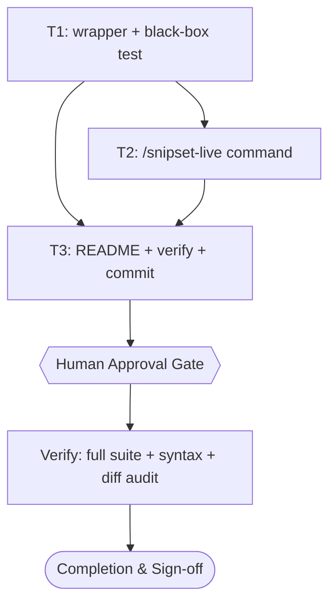

# snipset-live Wrapper Implementation Plan

> Frontmatter di atas adalah satu-satunya sumber kebenaran untuk routing, urutan dependensi, retry, dan idempotency. Prose di bawah hanya menjelaskan dan tidak boleh bertentangan. Setiap heading `Task <id>`, `tasks[].id`, dan node Mermaid harus identik.

## 1. Intent & Scope
- **Goal:** Menyediakan `scripts/snipset-live.sh`, wrapper shell yang membuat interaksi baca database Snipset Desktop efisien dari WSL/opencode (snapshot-sekali-per-sesi, injeksi `--db` + `--json` otomatis, tulis dikunci gerbang `doctor`), plus command `/snipset-live`, sehingga agen tidak perlu mengulang copy 218 MB manual dan tidak pernah menulis ke DB yang terkunci.
- **Non-Goals:** Mengubah CLI `snipset` atau skema DB (milik repo `~/Snipset`, di luar scope); operasi tulis saat aplikasi Desktop berjalan (tetap ditolak oleh desain); dukungan `SNIPSET_DB` env var di upstream; operasi bridge/live (pomodoro, journal-generate) yang sudah bekerja.
- **Acceptance Criteria:**
  - [ ] AC-1: Baca (`snippet list/get/search`, `stats`, dst.) berjalan melawan snapshot lokal tanpa flag `--db` manual, snapshot dibuat sekali dan dipakai ulang dalam satu sesi.
  - [ ] AC-2: Perintah tulis (`add/update/delete` dan selain daftar-baca) DITOLAK dengan pesan jelas saat `snipset doctor` terhadap live DB gagal (aplikasi berjalan/terkunci), dan diteruskan hanya saat doctor exit 0.
  - [ ] AC-3: `bun test tests/snipset-live.test.mjs` hijau (RED dulu sebelum implementasi), suite lama tetap hijau, `bash -n` bersih, tidak ada em dash di file user-visible baru.

## 2. Visual Implementation Map — MANDATORY

## 3. Global Constraints
- Live DB (`.../AppData/Local/Snipset/snipset.db`) tidak pernah ditulis saat aplikasi berjalan; satu-satunya tulis adalah perintah `snipset` itu sendiri setelah gerbang `doctor` lolos. Dilarang menimpa file live dari copy.
- Dilarang menyentuh `~/.profile` asli dan DB default Linux; fixture dan HOME sementara hanya di `/tmp` dan selalu dibersihkan.
- Repo ini tanpa lint/typecheck/build; verifikasi = `bun test` + `bash -n` + kontrak PowerShell yang sudah ada. Aturan sesi: bila butuh `cargo test`, hanya via `ssh civo-bcb` (tidak ada dalam scope ini).
- Komentar kode hanya untuk "mengapa" yang tidak jelas; tanpa em dash di copy user-visible; tanpa statistik/mock.
- HARD GATE skill: tidak ada implementasi sebelum plan ini disetujui eksplisit.

## 4. Work Breakdown & Task Checklist

### Task T1: Wrapper plus black-box test
- **Interfaces:**
  - Consumes: none (variabel lingkungan `SNIPSET_LIVE_DB`, `SNIPSET_LIVE_SNAPSHOT_DIR`, biner `snipset` di PATH)
  - Produces: `scripts/snipset-live.sh` (kontrak: snapshot-sekali, injeksi `--db snapshot`, daftar-baca lolos langsung, tulis wajib doctor-live exit 0), `tests/snipset-live.test.mjs`
- **Preconditions (assert FIRST; fail-fast):**
  - [ ] Dependency: `bun --version` dan `bash --version` exit 0 (else abort: `E_PRECOND_DEP`)
  - [ ] Input contract: `command -v snipset` exit 0 (else abort: `E_PRECOND_INPUT`)
  - On failure: STOP, catat ke §6, lanjutkan hanya task independen T1 (tidak ada).
- **Idempotency Check (BEFORE Step 1):**
  - [ ] Skip when `bun test tests/snipset-live.test.mjs` exit 0 → `SKIPPED-IDEMPOTENT`.
- [ ] **Step 1 — Failing Test (RED):** cmd: `bun test tests/snipset-live.test.mjs` | expect: exit non-zero (file test ada, skrip belum ada) | retry: 0. Test memakai stub `snipset` palsu di PATH (konvensi sama seperti `tests/install.test.mjs` memalsukan `curl`) dan fixture file DB: snapshot dibuat saat pertama dan dipakai ulang saat kedua (mtime sama), `--refresh` memaksa salin ulang, perintah baca menerima `--db` snapshot, tulis ditolak saat stub doctor gagal dan diteruskan saat doctor exit 0.
- [ ] **Step 2 — Implementation (GREEN):** `scripts/snipset-live.sh` minimal sampai test hijau. Allowlist baca eksplisit; selain itu = tulis dan masuk gerbang doctor.
- [ ] **Step 3 — Verify:** cmd: `bun test tests/snipset-live.test.mjs && bun test tests/install.test.mjs && bash -n scripts/snipset-live.sh` | expect: exit 0, 0 failures | retry: 1 (transient only) | on_fail: FAILED, tulis §6, halt T2+T3.
- [ ] **Step 4 — Commit:** `git add scripts/snipset-live.sh tests/snipset-live.test.mjs && git commit -m "feat(cli): add snipset-live snapshot wrapper with doctor-gated writes"` sebagai Iwan Kurniawan, tanpa trailer co-author.

### Task T2: Command /snipset-live
- **Interfaces:**
  - Consumes: `scripts/snipset-live.sh` dari T1
  - Produces: `.opencode/commands/snipset-live.md`
- **Preconditions (assert FIRST; fail-fast):**
  - [ ] Upstream: `scripts/snipset-live.sh` ada dan eksekutabel (else abort: `E_PRECOND_UPSTREAM`)
  - On failure: STOP, catat ke §6.
- **Idempotency Check (BEFORE Step 1):**
  - [ ] Skip when `test -f .opencode/commands/snipset-live.md` → `SKIPPED-IDEMPOTENT`.
- [ ] **Step 1 — Failing Test (RED):** tidak ada test kode untuk file prompt; ganti dengan cek eksistensi gagal: `test -f .opencode/commands/snipset-live.md` | expect: exit non-zero | retry: 0.
- [ ] **Step 2 — Implementation (GREEN):** tulis command dengan frontmatter `description` + `agent: build`, isi prompt: pakai wrapper untuk semua operasi snippet/stats, baca dari snapshot, tulis hanya setelah doctor-live hijau, larang copy manual dan larang tulis ke DB terkunci, bersihkan snapshot basi.
- [ ] **Step 3 — Verify:** cmd: `test -f .opencode/commands/snipset-live.md` | expect: exit 0 | retry: 0 | on_fail: FAILED, tulis §6, halt T3.
- [ ] **Step 4 — Commit:** `git add .opencode/commands/snipset-live.md && git commit -m "feat(opencode): add snipset-live assistant command"` sebagai Iwan Kurniawan, tanpa trailer co-author.

### Task T3: README plus verifikasi akhir dan commit
- **Interfaces:**
  - Consumes: T1 (wrapper), T2 (command)
  - Produces: bagian penggunaan di `README.md`, working tree bersih, commit akhir
- **Preconditions (assert FIRST; fail-fast):**
  - [ ] Upstream: T1 dan T2 selesai (file ada) (else abort: `E_PRECOND_UPSTREAM`)
  - On failure: STOP, catat ke §6.
- **Idempotency Check (BEFORE Step 1):**
  - [ ] Skip when `git log --oneline -1 --grep='snipset-live' | grep -q snipset-live` → `SKIPPED-IDEMPOTENT`.
- [ ] **Step 1 — Failing Test (RED):** tidak ada test kode; cek `git diff --stat` menunjukkan `README.md` termodifikasi setelah edit (sebelum edit, `git diff --quiet -- README.md` exit 0 sebagai baseline).
- [ ] **Step 2 — Implementation (GREEN):** tambah seksi penggunaan `scripts/snipset-live.sh` (variabel env, contoh baca, aturan tulis-butuh-aplikasi-tutup). Pindai em dash pada file baru/berubah.
- [ ] **Step 3 — Verify:** cmd: `bun test tests/ && bash -n scripts/snipset-live.sh install.sh && git status --short` | expect: exit 0, 0 failures, hanya file yang dimaksudkan | retry: 1 (transient only) | on_fail: FAILED, tulis §6.
- [ ] **Step 4 — Commit:** `git add README.md && git commit -m "docs: document snipset-live snapshot workflow"` sebagai Iwan Kurniawan, tanpa trailer co-author. Hapus file sementara `/tmp/snipset-*` yang masih ada.

## 5. Verification Matrix Before Completion
| Check | Command | Exit Code | Fresh Evidence | Status |
|---|---|---|---|---|
| New wrapper tests | `bun test tests/snipset-live.test.mjs` | 0 | 0 failures | Pending |
| Existing suite regression | `bun test tests/install.test.mjs` | 0 | 2 pass / 0 fail | Pending |
| Shell syntax | `bash -n scripts/snipset-live.sh install.sh` | 0 | no syntax errors | Pending |
| Worktree audit | `git status --short` | 0 | only intended files | Pending |
| Temp cleanup | `ls /tmp/snipset-*` | non-zero (absent) | no leftovers | Pending |

## 6. Error Ledger (aggregated at end; independent tasks not halted)
| Task | Step | Classification | Exit | Root cause | Retry used | Fallback | Status |
|---|---|---|---|---|---|---|---|
| - | - | - | - | none yet | - | - | - |

## 7. Human Approval Gate
- [ ] Partner / Human approval received for this plan before implementation begins.
