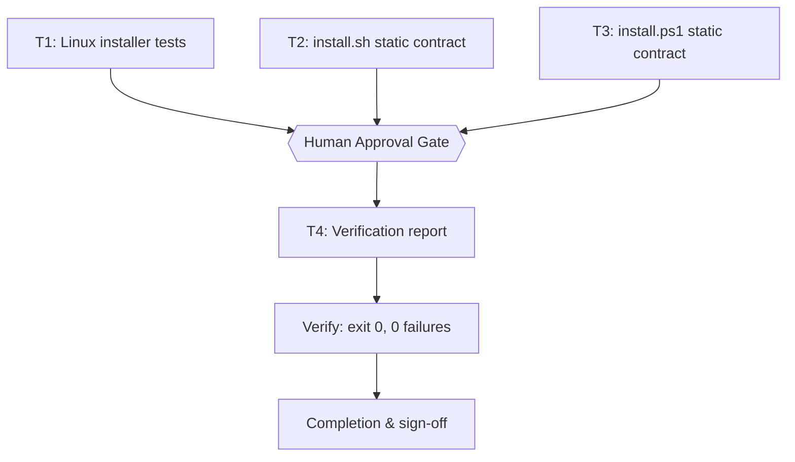

# Snipset CLI Verification & Production-Readiness Plan

## 1. Intent & Scope
- **Goal:** Verify the snipset-cli repository is production-ready by executing all runnable tests and confirming installer contracts, then record fresh evidence in a dated verification report.
- **Non-Goals:**
  - Do not modify installer logic (install.sh, install.ps1) unless a test proves a defect.
  - Do not add new tests beyond what the repo defines.
  - Do not attempt to run the PowerShell test if `pwsh` is unavailable (report as environment boundary).
- **Acceptance Criteria:**
  - [ ] AC-1: Linux installer tests pass (2/2) with exit 0.
  - [ ] AC-2: `install.sh` passes `bash -n` syntax validation and the documented contract.
  - [ ] AC-3: `install.ps1` passes static syntax/contract validation available without pwsh.
  - [ ] AC-4: PowerShell test execution status is explicitly recorded (runnable or environment-blocked).
  - [ ] AC-5: Fresh verification report written to `docs/verification/2026-09-21-report.md` with command evidence and exit codes.

## 2. Visual Implementation Map — MANDATORY

## 3. Global Constraints
- No changes to production installer logic unless a defect is proven by a failing test (systematic-debugging path then applies).
- `pwsh` is not installed in this environment; PowerShell runtime execution is an environment boundary, not a code failure.
- Commands run with `bun` for JS tests (node is a Bun wrapper here).
- Keep generated artifacts (report) in `docs/` and clean any temp files before commit.

## 4. Work Breakdown & Task Checklist

### Task T1: Linux installer tests
- **Interfaces:**
  - Consumes: `tests/install.test.mjs`, `install.sh`, `bash`, `tar`, `sha256sum`
  - Produces: test pass evidence (exit 0, 2 pass / 0 fail)
- **Preconditions (assert FIRST; fail-fast):**
  - [ ] Dependency: `bun --version` exits 0 (else abort: `E_PRECOND_DEP`)
  - [ ] Input contract: `tests/install.test.mjs` exists (else abort: `E_PRECOND_INPUT`)
- **Idempotency Check (BEFORE Step 1):**
  - [ ] Skip when `bun test tests/install.test.mjs` exits 0 → `SKIPPED-IDEMPOTENT` (fresh runtime proof only)
- [ ] **Step 1 — Run tests:** cmd: `bun test tests/install.test.mjs` | expect: exit 0, "2 pass / 0 fail" | retry: 1 (transient only)

### Task T2: install.sh static contract
- **Interfaces:**
  - Consumes: `install.sh`
  - Produces: syntax-validation evidence (exit 0)
- **Preconditions (assert FIRST):**
  - [ ] Input contract: `install.sh` exists (else abort: `E_PRECOND_INPUT`)
- **Idempotency Check (BEFORE Step 1):**
  - [ ] Skip when `bash -n install.sh` exits 0 → `SKIPPED-IDEMPOTENT`
- [ ] **Step 1 — Syntax validation:** cmd: `bash -n install.sh` | expect: exit 0 | retry: 1 (transient only)
- [ ] **Step 2 — Contract scan:** confirm required tokens (`SHA256SUMS`, `sha256sum`, `mktemp`, `tar`, `--install-dir`) present | expect: all found

### Task T3: install.ps1 static contract
- **Interfaces:**
  - Consumes: `install.ps1`
  - Produces: static-contract evidence (all required tokens present, no source leak) without pwsh
- **Preconditions (assert FIRST):**
  - [ ] Input contract: `install.ps1` exists (else abort: `E_PRECOND_INPUT`)
  - [ ] Note: `install.ps1` is PowerShell, so `bash -n` is NOT a valid validator. Static validation uses the token contract scan (same approach as `tests/install.Tests.ps1`). `pwsh` absent → runtime execution recorded as environment boundary.
- **Idempotency Check (BEFORE Step 1):**
  - [ ] Skip when the token-contract scan already reports all tokens present → `SKIPPED-IDEMPOTENT`
- [ ] **Step 1 — Contract scan:** confirm required tokens (`SHA256SUMS`, `Get-FileHash`, `Expand-Archive`, `x86_64-pc-windows-msvc`, `LOCALAPPDATA`) present and no `Cargo|crates` leak | expect: all found, no leak | retry: 1 (transient only)
- [ ] **Step 2 — Runtime status:** record `pwsh` availability (UNAVAILABLE → environment boundary; PowerShell test documented as not runnable here)

### Task T4: Verification report
- **Interfaces:**
  - Consumes: outputs of T1, T2, T3
  - Produces: `docs/verification/2026-09-21-report.md`
- **Preconditions (assert FIRST):**
  - [ ] Upstream: T1, T2, T3 completed (else abort: `E_PRECOND_UPSTREAM`)
- **Idempotency Check (BEFORE Step 1):**
  - [ ] Skip when `test -f docs/verification/2026-09-21-report.md` exits 0 → `SKIPPED-IDEMPOTENT`
- [ ] **Step 1 — Write report:** record command, exit code, fresh evidence per check in a dated markdown report | expect: file exists
- [ ] **Step 2 — Verify report:** `test -s docs/verification/2026-09-21-report.md` | expect: exit 0

## 5. Verification Matrix Before Completion
| Check | Command | Exit Code | Fresh Evidence | Status |
|---|---|---|---|---|
| Linux installer tests | `bun test tests/install.test.mjs` | 0 | 2 pass / 0 fail | Pending |
| install.sh syntax | `bash -n install.sh` | 0 | no syntax errors | Pending |
| install.ps1 static contract | token scan (SHA256SUMS, Get-FileHash, Expand-Archive, target, LOCALAPPDATA) | 0 | all tokens present, no source leak | Pending |
| PowerShell runtime | `pwsh tests/install.Tests.ps1` | n/a | pwsh unavailable (env boundary) | Blocked |

## 6. Error Ledger (aggregated at end; independent tasks not halted)
| Task | Step | Classification | Exit | Root cause | Retry used | Fallback | Status |
|---|---|---|---|---|---|---|---|
| (none yet) | | | | | | | |

## 7. Human Approval Gate
- [ ] Partner / Human approval received for this plan before implementation begins.
