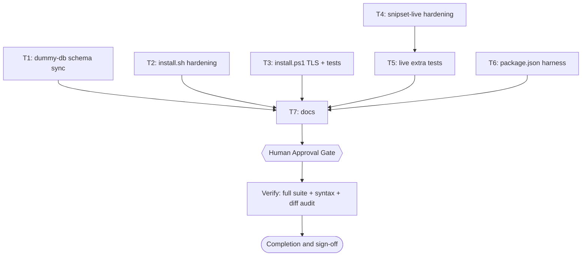

# Snipset CLI Gap Hardening Plan

> Frontmatter above is the single source of truth for routing, dependency order, retry, and idempotency. Prose below only explains and must never contradict it.

## 1. Intent & Scope

- **Goal:** Close the concrete completeness, effectiveness, and efficiency gaps in `snipset-cli` (installer scripts, live wrapper, test fixture, repo harness, docs) so every shipped behavior is tested, secure, and documented.
- **Non-Goals:** Changing the private Rust CLI binary behavior; migrating a live Desktop database schema; publishing releases; adding macOS or ARM build targets.
- **Acceptance Criteria:**
  - [x] AC-1: `tests/dummy-db.test.mjs` plus dependent pentest suites pass against the installed `snipset 0.2.0` schema fingerprint (exit 0).
  - [x] AC-2: `tests/install.test.mjs` passes after installer hardening (exit 0, 13 tests including the empty-version, `*` marker, shim-output, and `--help` RED cases).
  - [x] AC-3: `scripts/snipset-live.sh` plus new hardening tests pass (exit 0, 12 tests).
  - [x] AC-4: `install.ps1` contract holds after TLS 1.2 fix; runtime recorded as an environment boundary (no `powershell.exe` on this host), token scan clean.
  - [x] AC-5: Repo gains `package.json` test entrypoint, uninstall docs, and `--help` parity; full local suite is green (42 pass, 0 fail).

## 2. Visual Implementation Map

## 3. Global Constraints

- Work only inside the session worktree `/home/belajarcarabelajar/Proyek/snipset-cli-wt/gap-hardening`. Never edit the parent checkout.
- TDD per task: reproduce RED first, then GREEN, then verify.
- Shell changes must pass `bash -n` and `shellcheck -S warning` with zero findings.
- No em dash in the PR body, commit messages, or any user-visible string in the diff.
- Parent-only git writes: no commits from any helper; deliverable is tested file state.
- Web evidence (TinyFish) is required only for the TLS claim; all other gaps are verified from local sources (installed `snipset 0.2.0`, `snipset init` output, shellcheck, test exit codes).
- TLS evidence: GitHub crypto deprecation notice dated 2017-02-27 (fetched 2026-10-06, https://github.blog/engineering/platform-security/crypto-deprecation-notice/); PowerShell TLS default behavior per Pauby article dated 2017-07-04 (fetched 2026-10-06, https://blog.pauby.com/post/force-powershell-to-use-tls-1-2/).

## 4. Work Breakdown

### Task T1: Dummy DB schema sync (P0)

- RED: `bun test tests/dummy-db.test.mjs` exits non-zero with `missing columns: groups.research_tag`.
- GREEN: add `research_tag` to `GROUP_COLUMNS`; sync defaults to authoritative values from a fresh `snipset init` DB (snipset 0.2.0, probed 2026-10-06): groups.description default empty string, groups.enabled default 1, snippets.matching_mode default Strict, snippets.case_sensitivity default CaseSensitive, snippets.content_type default Text, snippets.description default empty string. Keep tables, FTS5 definition, triggers, WAL mode unchanged.
- Verify: `bun test tests/dummy-db.test.mjs tests/pentest-core.test.mjs tests/pentest-aux.test.mjs`, expect exit 0.

### Task T2: install.sh hardening (P1)

- RED: fixture test proving empty `--version ""` normalizes to `v` without cleanup; SHA256SUMS binary-marker (`*`) entry rejected; unchecked `snipset-shims` output.
- GREEN: fix version parsing so the empty check runs before validation (drop the dead post-check); strip `*`/space marker when matching checksum entries; reject tar members with newline or leading `-`; sanitize newline chars in install/share/bashrc paths; warn when shim generation yields nothing; add `--help`/`-h` with exit 0.
- Verify: `bash -n install.sh`, `shellcheck -S warning install.sh`, `bun test tests/install.test.mjs`.

### Task T3: install.ps1 TLS 1.2 plus contract tests (P1)

- RED: contract test asserting `SecurityProtocol` plus `Tls12` fails on current content.
- GREEN: set `[Net.ServicePointManager]::SecurityProtocol = Tls12` before network calls with a short why-comment; extend `tests/install.Tests.ps1` with the two tokens.
- Verify: token scan on Linux; powershell.exe runtime only when reachable (else recorded as environment boundary).

### Task T4: snipset-live.sh hardening (P1/P2)

- RED: fixture tests proving duplicate user `--db` forwarded twice; `expand` misclassified as write; stale snapshot reused after live DB replaced.
- GREEN: filter user `--db`/`--db=*` from forwarded args on both paths; normalize trailing slash on snapshot dir; treat `snippet expand` as read; refresh snapshot when live DB is newer than snapshot; add `--help`/`-h` with exit 0.
- Verify: `bash -n`, `shellcheck -S warning`, `bun test tests/snipset-live.test.mjs`.

### Task T5: Extra live wrapper tests (P2)

- RED: `tests/snipset-live-hardening.test.mjs` missing.
- GREEN: cover db filtering, expand read routing, stale-snapshot refresh, help exit 0, `=` form rejection.
- Verify: `bun test tests/snipset-live-hardening.test.mjs`.

### Task T6: package.json harness (P2)

- RED: `test -f package.json` exits non-zero.
- GREEN: minimal package.json with test script, no new dependencies.
- Verify: `bun run test` exits 0.

### Task T7: Docs gap close (P2/P3)

- RED: `grep -q uninstall README.md` exits non-zero.
- GREEN: document exact Linux and Windows uninstall steps (never the database), `--help` for installers and wrapper, `snippet expand` read classification, snapshot staleness behavior; fix stale asset/target wording. Codebase language is English, no em dash.
- Verify: grep checks pass; full suite green.

## 5. Verification Matrix Before Completion

| Check | Command | Exit Code | Fresh Evidence | Status |
|---|---|---|---|---|
| Dummy fixture | `bun test tests/dummy-db.test.mjs` | 0 | 1 pass / 0 fail | Verified |
| Core pentest | `bun test tests/pentest-core.test.mjs` | 0 | 9 pass / 0 fail | Verified |
| Aux pentest | `bun test tests/pentest-aux.test.mjs` | 0 | 7 pass / 0 fail | Verified |
| Installer | `bun test tests/install.test.mjs` | 0 | 13 pass / 0 fail | Verified |
| Live wrapper | `bun test tests/snipset-live.test.mjs tests/snipset-live-hardening.test.mjs` | 0 | 12 pass / 0 fail | Verified |
| Shell syntax | `bash -n install.sh scripts/snipset-live.sh` | 0 | no syntax errors | Verified |
| Shellcheck | `shellcheck -S warning install.sh scripts/snipset-live.sh` | 0 | 0 findings | Verified |
| Full suite | `bun test tests/` | 0 | 42 pass / 0 fail | Verified |
| PowerShell runtime | `powershell.exe ... tests/install.Tests.ps1` | n/a | `powershell.exe` unavailable on this host (env boundary) | Blocked (env) |

The four T2 RED cases (empty `--version`, SHA256SUMS `*` marker, shim output warning plus its negative, and `--help`) were confirmed failing against the pre-hardening `install.sh` and passing against the hardened installer.

## 6. Error Ledger

| Task | Step | Classification | Exit | Root cause | Retry used | Fallback | Status |
|---|---|---|---|---|---|---|---|
| T2 | Test | test | n/a | Hardened `install.sh` shipped before `tests/install.test.mjs` gained its RED cases | 0 | Added 4 tests; confirmed RED against pre-hardening source, GREEN after | RESOLVED |

## 7. Human Approval Gate

- [ ] Partner / Human approval received for this plan before implementation begins.
